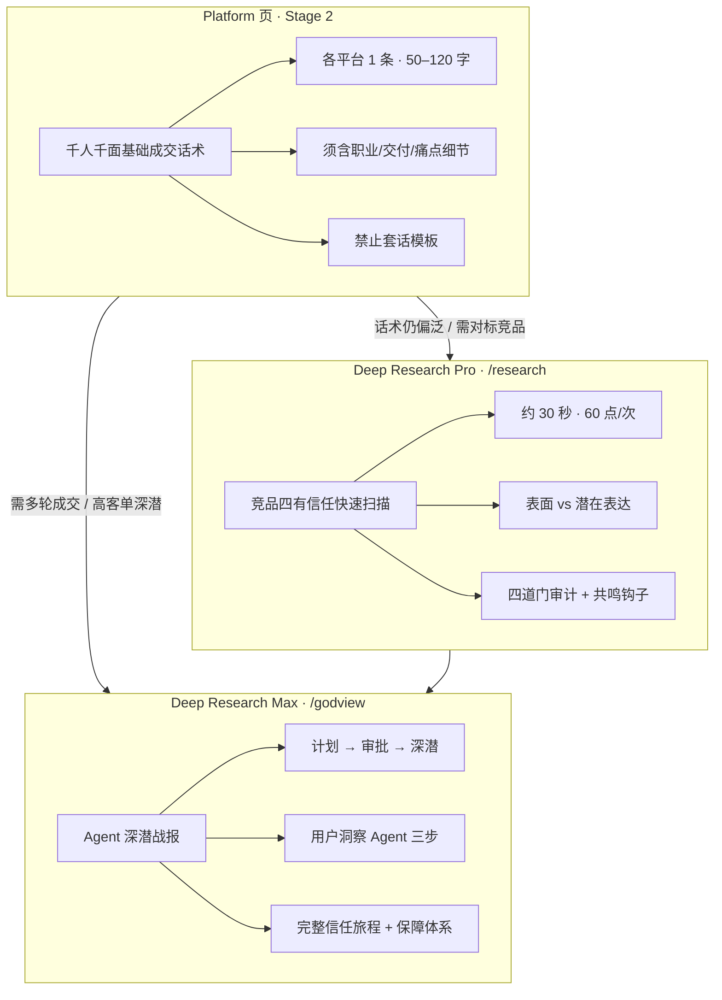

# Deep Research Pro / Max 图文使用指南

本指南说明 **Platform 基础成交话术** 与 **Deep Research Pro（竞品）**、**Deep Research Max（上帝视角）** 的分工与操作流程。

---

## 一、三层能力分工



| 层级 | 入口 | 耗时 | 产出 | 适用场景 |
|------|------|------|------|----------|
| **Platform 基础层** | `/platform` Stage 2 完成后 | 随分析一并生成 | 各平台 **1 条** 千人千面基础话术 | 笔记结尾、私信首句、直播轻承接 |
| **Deep Research Pro** | `/research` 或上帝视角内嵌 iframe | ~30 秒 | 竞品四有扫描 + 3 条共鸣钩子 + 脚本处方 | 对标竞品、快速优化钩子与切口 |
| **Deep Research Max** | `/godview` 高阶 Agent | 30–90 分钟 | 万字战报 + **四有信任专章** | 高客单、完整成交剧本、保障体系设计 |

---

## 二、Platform 基础成交话术 · 使用说明

### 2.1 生成条件

1. 在 Platform 页输入 **focusPrompt**（你的行业、身份、交付物）。
2. 完成 **Stage 1 战略看板** + **Stage 2 专属文案**。
3. 在「各平台基础成交话术」区块查看 **抖音 / 快手 / 小红书 / B站** 各 1 条。

### 2.2 千人千面要求（系统强制）

每条话术必须包含：

- **targetAudience**：具体人群（禁止「创业者」「泛用户」）。
- **audiencePain**：对方没说出口的潜在表达。
- **personalAnchor**：仅适用于**你**的一句话锚点（职业、交付、场景物件）。
- **basicClosingScript**：50–120 字，先共鸣后轻承接。

**禁止套话**，例如：「私信我了解更多」「我可以帮你打造 IP」「限时优惠」「欢迎咨询」等。

若 UI 提示「检测到套话倾向」，请：

1. 在 focusPrompt 中补充更具体的职业、交付名称、典型客户场景后 **重新分析**；或
2. 使用下方 Deep Research Pro / Max 深潜改写。

### 2.3 各平台建议使用场景

| 平台 | usageScene 常见值 | 语感提示 |
|------|-------------------|----------|
| 抖音 / 快手 | 直播口播 / 短视频结尾 | 口语短句、可拍画面 |
| 小红书 | 笔记结尾 / 私信首句 | 笔记体、具体场景 |
| B站 | 评论区置顶 / 视频简介 | 理性论证 + 行动引导 |

---

## 三、Deep Research Pro · 竞品四有信任（60 点/次）

### 3.1 入口

- 独立页：[`/research`](https://你的域名/research)
- 上帝视角内嵌：[`/godview`](https://你的域名/godview) → 「Deep Research Pro · 竞品四有信任」

### 3.2 操作步骤

```
① 选择平台（小红书 / 抖音 / 快手 / B站）
② 粘贴竞品文案、爆款标题、逐字稿或账号描述（5000 字以内）
③ 点击执行（扣除 60 点）
④ 约 30 秒获取「四有信任 · Pro 快速扫描」+ 分镜脚本处方
```

### 3.3 产出说明

- **表面表达 → 潜在表达** 对照表
- **四道门审计**（有共鸣 / 有方法 / 有案例 / 有保障，1–10 分）
- **普通写法 vs 共鸣写法** 对照
- **3 条共鸣钩子**（可直接做内容开头）
- **scenes** 分镜脚本（开场须用共鸣写法）

### 3.4 与 Platform 话术的配合

1. 在 Platform 生成基础话术后，若觉得「不够尖、不够对标」，把 **赛道头部竞品文案** 粘贴到 Pro。
2. 用 Pro 输出的 **resonanceHooks** 改写 Platform 的 `basicClosingScript`。
3. 将改写后的话术用于实际发布，观察私信/评论转化。

---

## 四、Deep Research Max · 上帝视角 Agent 深潜

### 4.1 入口

- 主入口：[`/godview`](https://你的域名/godview)
- 高阶场景：「竞品 / 赛道雷达」「多平台 IP 矩阵」等 Agent 卡片

### 4.2 流程（计划 → 审批 → 深潜）

```
① 填写课题 + 可选上传 PDF/图片/补充说明
② Agent 生成研究计划（约 10–30 分钟）
③ 你在上帝视角 **审核计划**（可填反馈，如「重点看小红书私信语料」）
④ 批准后开始深潜（约 30–90 分钟）
⑤ 战报进入「战略作品快照库」，含独立「四有信任体系与 AI 用户洞察」专章
```

### 4.3 Max 专章包含（深度成交）

- **用户洞察 Agent 三步**：主题归类 → 挖潜在表达 → 共鸣钩子库（≥15 条）
- **四道门信任旅程蓝图** + 信任临界点诊断
- **方法论 SOP**（动作挖掘四问提炼）
- **预先布置的保障体系**（≥5 条，含触发时机与话术）
- **持续信任 vs 短暂信任** 旅程设计

### 4.4 何时从 Pro 升级到 Max

| 信号 | 建议 |
|------|------|
| 客单价高、决策周期长 | 直接用 Max，设计完整保障与多轮话术 |
| Pro 扫描后四道门「有保障」< 6 分 | Max 专章补全降险与异议处理 |
| 需要销售录音/客服记录级深潜 | Max + 上传补充文件 |
| 仅优化单条笔记钩子 | Pro 足够 |

---

## 五、推荐工作流（图文）

```
Platform focusPrompt
       ↓
Stage 1 + Stage 2（含各平台基础成交话术 · 千人千面）
       ↓
   ┌───┴───┐
   │ 够具体？ │
   └───┬───┘
      否 ↓ 是 → 直接发布测试
Deep Research Pro（贴竞品 · 60 点）
       ↓
   仍缺多轮成交 / 高客单保障？
       ↓ 是
Deep Research Max（上帝视角 · 计划→审批→深潜）
       ↓
战报四有专章 → 回写 Platform 话术与选题
```

---

## 六、常见问题

**Q：Platform 话术和 Pro 输出的钩子有什么区别？**  
A：Platform 是**你的**人设 × **各平台** 各 1 条基础承接；Pro 是**竞品**四有扫描 + 可复用的共鸣钩子结构，用于对标优化。

**Q：为什么强调千人千面？**  
A：套话换一个人设仍成立，无法建立信任。系统要求每条含 `personalAnchor` 与具体交付细节。

**Q：Max 一定要等 90 分钟吗？**  
A：复杂课题可能接近上限；计划阶段可先审阅方向，避免深潜跑偏。

---

*文档版本：与 `feat/deep-research-trust-pro-max` 分支同步。*
